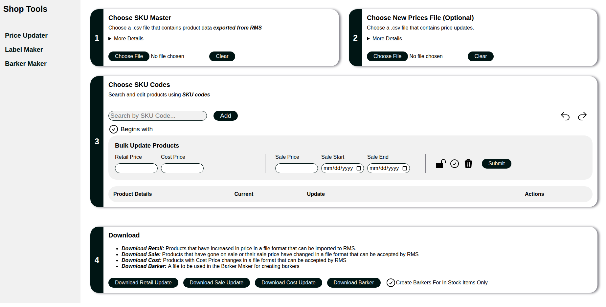
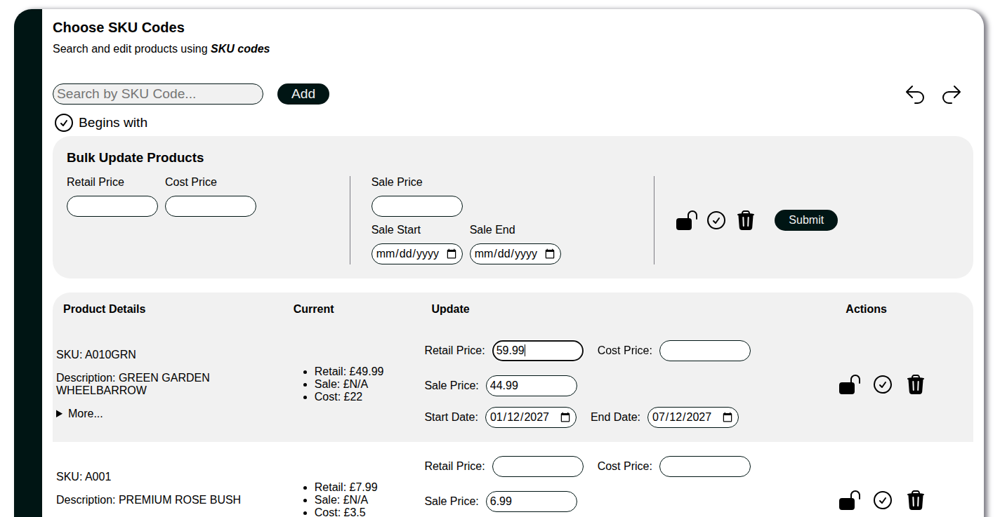
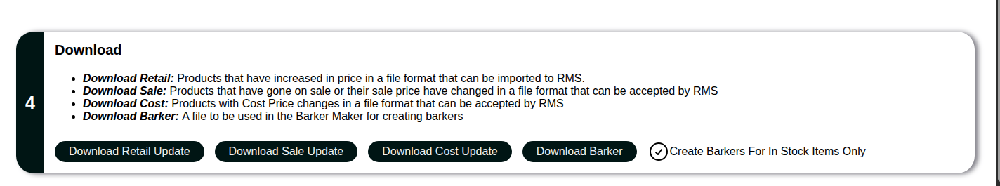

# Retail-Operations-Suite
A suite of vanilla JavaScript tools designed to streamline retail workflows through CSV processing, data validation, and automated exports.


# Retail Operations Suite

An anonymised version of an internal retail tool suite I built to automate pricing updates and reduce repetitive manual work.

The original application is used to prepare bulk price changes for import into a retail management system. It validates user input, enriches product information from a master SKU export, determines which products require updates, and generates import-ready CSV files. No frameworks or modules were used to allow the apps to be opened as a file, allowing for easy installation and sharing.

This repository contains a portfolio-safe version with all proprietary business data removed.

---

## Features

- Import retail management system (RMS) SKU master exports
- Import bulk pricing updates via CSV
- Search and add products individually
- Automatic product enrichment from master SKU data
- Retail, sale and cost price comparisons
- Generate import-ready CSV files for:
    - Retail price updates
    - Sale price updates
    - Cost price updates
- Generate promotional "barker" CSV exports
- Bulk editing of selected products
- Product locking to prevent accidental edits
- Undo / Redo support
- SKU search
    - SKU "begins with" search

---

## Technologies

- HTML5
- CSS3
- Vanilla JavaScript (ES6)

No frameworks or external libraries are used.

---

## Running Locally

Clone the repository:

```bash
git clone git@github.com:Jonathan-Winter-Dev/Retail-Operations-Suite.git
```

Open:

```
price-updater/index.html
```

in your browser.

---

## Demo Data

Example CSV files are included in the `demo-data/` directory.

```
demo-data/
├── sku-master.csv
└── price-update.csv
```

These contain anonymised sample data that can be used to test the application without any proprietary information.

---

## Project Structure

```
Retail-Operations-Suite/
│
├── demo-data/
│   ├── sku-master.csv
│   └── price-update.csv
│
├── images/
│
├── price-updater/
│   ├── index.html
│   ├── price-updater-styles.css
│   └── price-updater-script.js
│
└── README.md
```

---

## Screenshots

### Main Interface


```markdown

```

### Product Editing


```markdown

```

### CSV Export


```markdown

```

---

## Why I Built This

While working in retail, large pricing updates were time-consuming and error-prone. Existing workflows relied heavily on spreadsheets and manual data manipulation.

I built the original version of this application to automate those processes by:

- reducing repetitive manual work
- validating imported data
- generating correctly formatted import files
- improving consistency and reducing user error

Rebuilding the application as a standalone portfolio project gave me the opportunity to redesign the architecture, improve maintainability and remove all company-specific data.

---

## Future Improvements

This repository is intended to become a suite of retail operations tools.

Planned additions include:

- Label Maker
- Promotional Barker Creator
- Product Sign Generator
- Improved CSV parsing
- Modular ES Module architecture
- Automated testing
- Build tooling with Webpack

---

## License

This repository is provided for portfolio and educational purposes only.

All company-specific data, product information and proprietary business logic have been removed or anonymised.